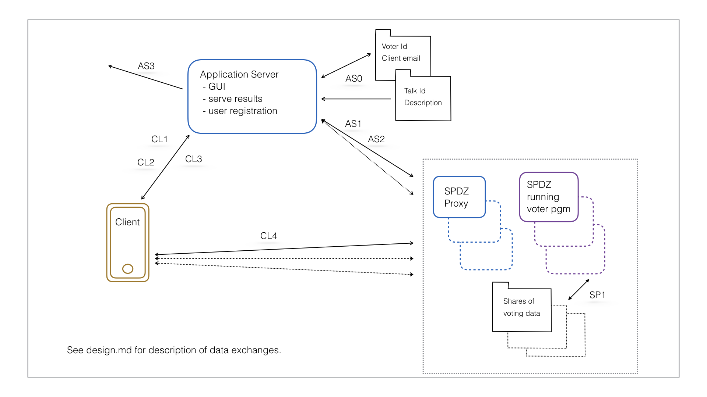

## Workshop voting MPC demonstrator

### Description

Any user is able to load a web application which allows them to view a list of workshop talks along with the top 3 ordered by the number of votes cast. The count of votes will be displayed.

Attendees at the TPMPC workshop will be able to use a unique voter id (either acquired offline or possibly via an auto enrolling interface using an email address) to cast votes for their top 3 talks. Casting votes more than once will be allowed, with the previous votes replaced.

The privacy design is such that as long as their is at least 1 honest SPDZ engine the only information revealed about votes is the aggregated total of the top 3 talks. Individual votes can not be recovered. 

The security design is less robust, information about the available unique voter ids is stored on the application server and so potentially vulnerable. If a self registration feature is implemented then it could be open to abuse. These weaknesses are acknowledged as the primary purpose of this demonstrator is to show off the capabilities of SPDZ in real world applications.

### Design

This section introduces the high level design message flows for the SPDZ MPC Demonstrator.  



### Application Server

Provides services to clients who wish to take part in the workshop voting demonstrator. It acts as:

- an entry point for the application, serving the client GUI,
- a user registration service to allow users to acquire their voting id (optional feature),
- a results server to offload reading results directly from the SPDZ engines.

Will most likely be implemented as a node.js server running express and providing rest endpoints to the client:

- `/` *access voting GUI*
- `/talks` request a list of talks
- `/register` register a user email with a voting id
- `/results` read for the latest results, likely a sockets interface to push updates.

The data exchanges for the application server are:

***AS0*** At startup load the voter id and talks data from the file system. As clients register update the voter id with the client email (optional feature).

***AS1*** At startup and periodically until a connection is made, or if the connection is closed:

1. make connections to each SDPZ engine
2. don't send public key as predistributed to SPDZ engines
3. send authenticated encrypted valid voter ids and talk ids to be stored in memory (shares or full values?)
4. make the GUI served endpoint available for clients

***AS2*** When updated results are sent from each SPDZ engine:

1. receive the top three talk ids with votes as encrypted revealed values
2. make these available on `/results` for the GUI 

***AS3*** When a voter registers for a voter id with an email or re-requests the voter id, record the email against the voter id and use SMTP to send the value out, (optional feature). 

### Clients###

***CL1*** A client connects to the application server with a browser and requests a list of talks.

***CL2*** A web socket is opened with the applicaiton server to receive latest results.

***CL3*** The client registers with an email address by requesting a voter id from the application server, sent by email. Resend available. This is an optional feature.

***CL4*** A client may vote for their top 3 talks after entering a voter id and presseing the  vote button to:

1. make connections to each SPDZ engine and send the client public key,
2. receive 4 encrypted shares from each SPDZ engine, combine with the voter id and 3 talk ids and send to all engines 
3. wait for an encrypted success or failure response and display this result back to the user
4. close connections to each SPDZ engine

### SPDZ Engine

Note that the application server and clients access the SPDZ engines via [SPDZ proxies](https://github.com/bristolcrypto/spdz-proxy) but these have no special requirements for this application and are not discussed further. 

Each SPDZ Engine runs the workshop voting program:

```
Initialse voter-history as a Matrix with columns voter id, talk id1, talk id2, talk id3
SP1 Load the share of voter-history to date from disk if this is a restart. 

Listen for socket connections with LISTEN

Accept first connection with ACCEPTCLIENTCONNECTION
  Remember socket id as application server socket
  Note application server public key is hardcoded or read from disk, not via socket
  Read and store voter ids and talk ids via authenticated encrypted values (shares or full
     values?) - will fail if not expected application server.
  calculate top 3 talks from voter-history and send encrypted shares to application server socket

While true
  Accept a client connection with ACCEPTCLIENTCONNECTION
  Recieve client public key with REGINT.READ_CLIENT_PUBLIC_KEY
  Send 4 encrypted shares to the client and read the resulting input.
  Validate the voter id and talk ids against the valid list (how - need to reveal or run
     against shares?).
  If any are invalid
    send an encrypted error response to the client
  else
    insert or update the new votes from the client into the voter-history
    calculate top 3 talks from voter-history and send encrypted shares to application 
      server socket
    send an encrypted success response to the client
    open the voter-history disk file
    SP1 write the voter shares to disk to persist votes through a restart
    close the voter-history disk file
  Close client connection, ensure all resources released
```

### Questions / Issues:

1. What is the best way to validate a share of the user input (voter id and talk id) without revealing the inputs? What should the program be validating against ?
2. Because the SPDZ program processing runs in a single thread, clients will potentially be blocked between making the SPDZ connections (which do run in separate thread) and reading the shares from SPDZ. This potential delay will need a 'sensible' timeout, before the voting attempt is flagged as failed. It will be possible for the vote to be re-tried.
3. As this needs to be a long running process (at least for the 1 week duration of the workshop) their needs to be some persistence mechanism for votes cast. The idea proposed above is to record a transaction log where each vote cast can be added to the end of a file. As these are shares, privacy is maintained. On a restart these transactions can be replayed to build up the voter-history data structure. Is there a better way of achieving this?

### Other Notes

It is worth starting to think about classes of SPDZ applications as these are likely to present similar requirements and features. 

This demonstrator is an example of an application where SPDZ is calculating a result over independantly supplied client input. There is no coordination needed between clients.